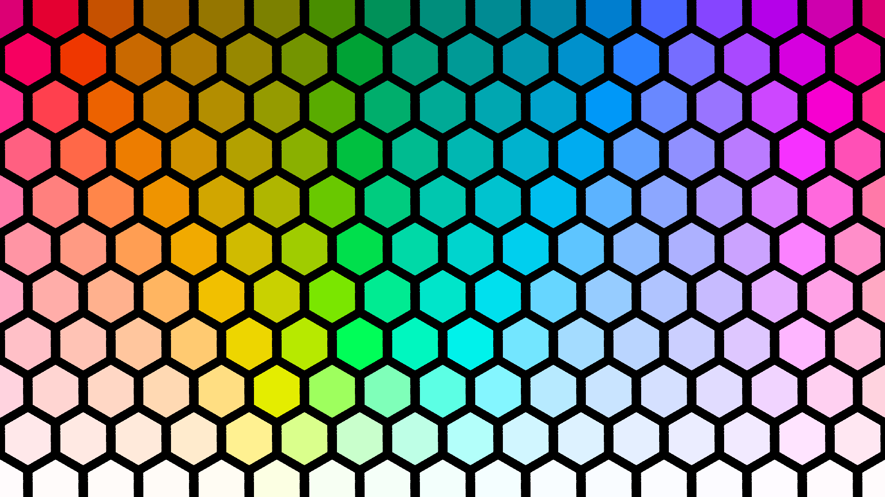
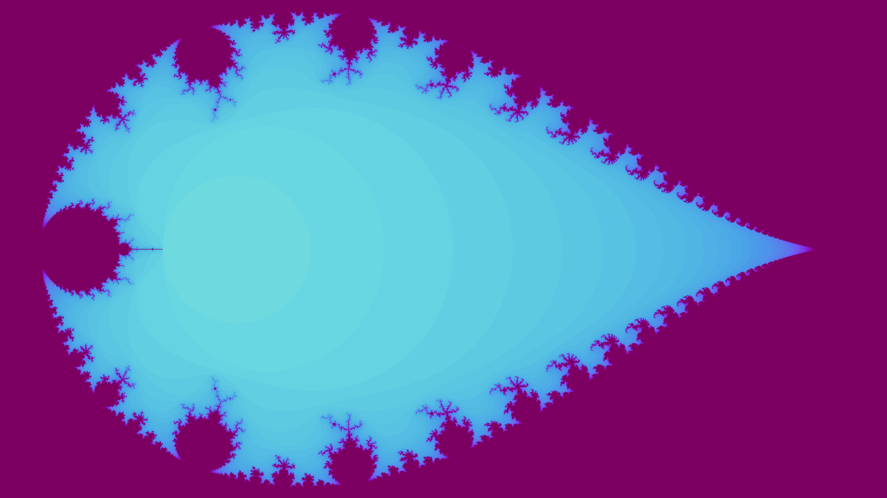

# Papero
### By Gabriel Garriock

Welcome to papero, a project about generating cool wallpapers.

This repo is a culmination of various different iterations of this idea of the years. 

Enjoy the best results below.

PS: In order to create this file just run `cargo test --release -- nocapture`

---

Bitwise Image Magic

---

Boring gradient test

---

Domain Warping

---

Flow

---

Hexagons

---

Hilbert Curve

---

Julia (Jazzmine)

.png)

---

Mandelbrot

---

Noisy renderer

---

Sierpiński's Triangle

---

Spiral

---

Voronoi

---

Waterfall

